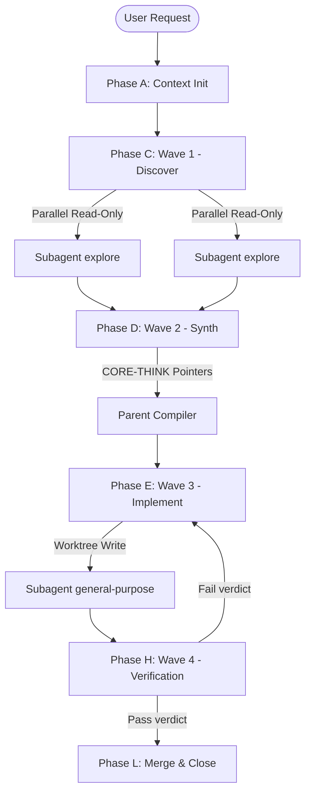

# AKOS / AZOP System Specification

## 1. System Overview

This specification formalizes the **Apex Knowledge OS (AKOS)** directory layouts and the **A-Z Orchestration Protocol (AZOP)** wave mechanics. It defines the structural layout, execution pipeline, and verification gates designed to orchestrate high-agency agentic operations with maximum token conservation and zero-copy runtime efficiency.

---

## 2. Directory Layout Specification

The AKOS workspace is structured as a decentralized, private-first metadata repository. Every artifact, schema, and registry must adhere strictly to the following directory layout:

```
AKOS/
├── README.md               # Executive mission statement and quickstart
├── AKOS.md                 # Sovereign governance statement and security rules
├── SPECIFICATION.md       # [This File] Architecture and wave mechanics spec
├── GOVERNANCE.md           # Access control policy and promotion gates
├── REPOS.md                # Mapping of active, private, and public repositories
├── IDENTITY.md             # Cryptographic operator footprint
├── EASTER_EGGS.md          # Silent expert prompt configurations
├── contracts/              # Strict schema definitions (JSON Schema, YAML)
├── manifests/              # Snapshot registries of the active repository map
├── specs/                  # Technical design briefs for core components
└── ledger/                 # Token-saver savings ledger
```

### Core Manifest Files
*   **`AKOS_MANIFEST.yaml`**: The primary configuration containing active session profiles, model mappings, and local credential references.
*   **`REPOS.md`**: Index of the 1,100+ repository footprint, partitioned between `public` (engineering portfolio exhibits) and `private` (sensitive operations, legal cases, and system configurations).
*   **`GOVERNANCE.md`**: Operational rules guarding the promotion of private codebases to the public organization.

---

## 3. A-Z Orchestration Protocol (AZOP) Wave Mechanics

The AZOP execution loop organizes agent reasoning into structured, non-overlapping waves. This structure prevents context pollution, isolates writes, and enforces automatic quality verification.



### Phase Breakdown

#### Phase A: Context Initialization & Session Register
*   **Goal**: Initialize runtime metadata and establish session registry.
*   **Action**: Query local state maps (`ecosystem_map.json`) and run `register_gemini_session.py`.
*   **Constraint**: No network/external calls are allowed before identity verification.

#### Phase C: Wave 1 - Parallel Discovery (MICROWAVE)
*   **Goal**: Gather codebase patterns and target file layouts without polluting the parent context.
*   **Action**: Spawn $N$ parallel `explore` subagents with `capability_mode = "read-only"` and `background = true`.
*   **Output**: Each child returns a maximum 5-bullet summary + file line range references (e.g., `file.py#L40-52`). No raw codebase dumps are returned to the parent.

#### Phase D: Wave 2 - Speculative Synthesis (CORE-THINK)
*   **Goal**: Synthesize discovery manifests and design the implementation plan.
*   **Action**: The parent agent processes the subagents' pointer summaries, running sequential thinking steps to map dependencies.
*   **Constraint**: If ambiguity or risk scales above $7/10$, enter `plan_mode` and check checklists before writing any file.

#### Phase E: Wave 3 - Isolated Implementation (VIPER)
*   **Goal**: Safely modify code without breaking the active working tree or locking files.
*   **Action**: Spawn a `general-purpose` subagent with `isolation = "worktree"` and `capability_mode = "read-write"`.
*   **Output**: The subagent checks out a separate git worktree, applies changes locally, and tests them in isolation.

#### Phase H: Wave 4 - Verification (SHERLOCK-ALPHA)
*   **Goal**: Enforce strict quality gates prior to integration.
*   **Action**: Invoke the `/check-work` verifier loop to execute tests, linters, and semantic checks inside the worktree environment.
*   **Verdict Rule**:
    *   `VERDICT: PASS` $\implies$ Proceed to Phase L (Merge).
    *   `VERDICT: FAIL` $\implies$ Re-enter Phase E to correct the code. Repeat up to 3 times.

#### Phase L: Wave 5 - Integration & Compaction
*   **Goal**: Consolidate changes and flush volatile states.
*   **Action**: Merge the isolated worktree changes back into the main branch. Trigger token compaction with `auto_compact_threshold_percent = 70`.

---

## 4. Token-Saver Context Rules
1.  **Pure Pointer Rule**: Never dump full files into the chat context. Keep references as clean pointer links (`[file.py](file:///path/to/file.py#L12-L24)`).
2.  **Volatile Hook Rule**: Formatters and linters must execute as silent `PreToolUse` or `PostToolUse` hooks (SONIC protocol) to prevent stdout noise from expanding the conversation context.
3.  **Compaction Rule**: Keep the auto-compaction threshold at `70%`. Raising it to `85%` causes the LLM to retain obsolete tool history longer, degrading model reasoning accuracy.
